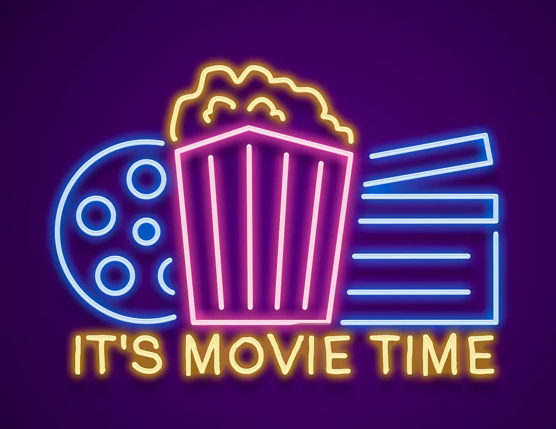

   

<h1>Cinema booking service</h1>

Simple RESTful web application that will help you manage a small movie theatre:

- go through registration and later authentication process
- authorize your clients with user role and administrations with admin role
- add different movies and cinema halls (admin rights) 
- schedule and change your movie sessions (admin rights)
- choose available movie session and buy tickets (user right)
- complete the order or check your orders' history (user right)

| Technologies and tools         |
|--------------------------------|
| Spring MVC and Spring Security |
| ORM Hibernate                  |
| Java 11 or later               |
| Apache Maven                   |
| Apache Tomcat 9.0.50           |                                |
| MySQL 8.0.22 community version |
| IDE IntelliJ Ultimate          |

### Configuration

➡️️ Clone the project from GitHub  
➡️️ Configure connection to DB in [db.properties](src/main/resources/db.properties) file in src/main/resources  

        db.driver=YOUR_DATABASE_DRIVER
        db.url=YOUR_DATABASE_URL
        db.user=YOUR_DATABASE_USERNAME
        db.password=YOUR_DATABASE_PASSWORD

➡️️ Configure your local Tomcat server (recommended to use [v.9.0.50](https://archive.apache.org/dist/tomcat/tomcat-9/v9.0.50/)).  
➡️️ Take your seat, run the app, it's movie time! 🍿🧋🎬

_*If you have any questions, or you want to give feedback,  feel free to contact!_
